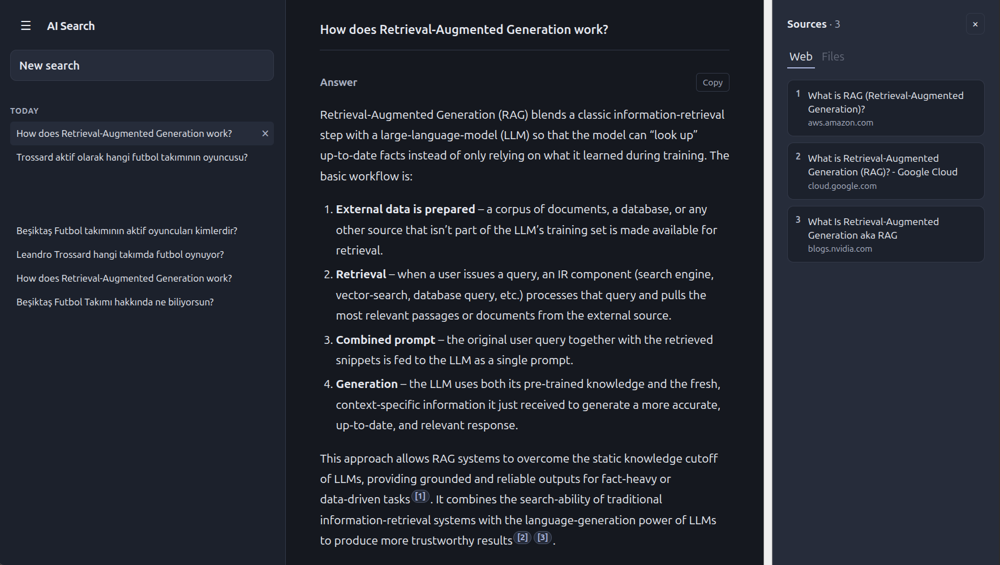
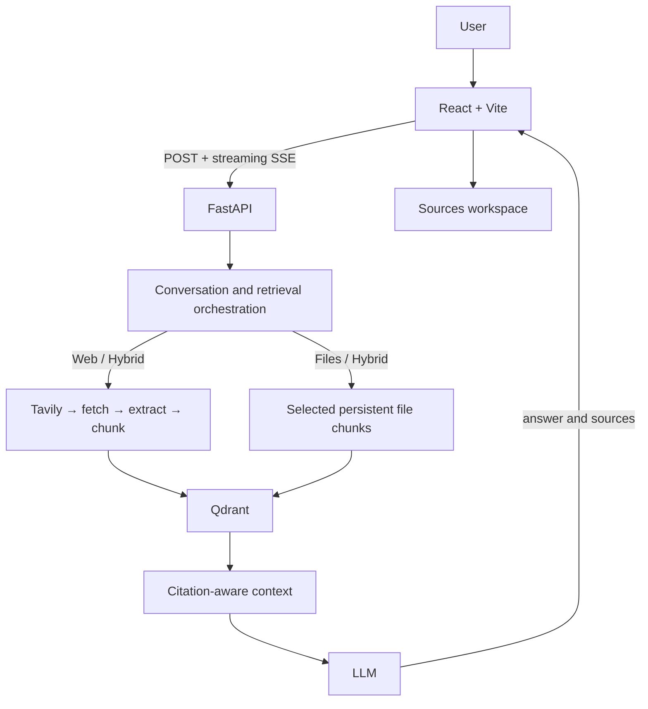

# AI Search Engine

AI Search Engine is a citation-aware research workspace that combines live web search, selected-document retrieval, conversational follow-ups, and hybrid RAG. It is designed to make the evidence behind an answer inspectable—not to be a generic chat clone.

## Live Demo

- Frontend: [ai-search-engine-wine-three.vercel.app](https://ai-search-engine-wine-three.vercel.app)
- Backend health: [ai-search-engine-api.onrender.com/health](https://ai-search-engine-api.onrender.com/health)

> The Render free-tier backend can take longer on the first request after inactivity.

## What It Does

Ask a question, continue the conversation, attach documents when needed, and inspect the Web or file evidence attached to each assistant answer. Answers stream progressively over SSE, while history and document metadata remain local to the browser.

## Key Features

- Live Tavily web retrieval with fetch, extraction, chunking, and citation-aware answers
- PDF, TXT, Markdown, and DOCX retrieval scoped to selected documents in one conversation
- Web, Files, and Web + Files research modes
- Follow-up questions with bounded, deterministic search-query composition
- Per-assistant-message citations: `[n]`, `【n】`, and grouped markers such as `[1,4]`
- Desktop Sources workspace and mobile Sources drawer, with Web/File filtering
- Browser-local IndexedDB history, sidebar history, New Search, refresh restore, and `/c/:id` deep links
- Streaming answers through `POST` + `fetch` + ReadableStream SSE parsing
- Responsive sidebar and Settings with System, Light, and Dark themes

## Product Preview



## Architecture



For the component boundaries, retrieval ownership, citation pipeline, and lifecycle details, see [Architecture](docs/architecture.md).

## Retrieval Modes

| Mode | Evidence | Lifecycle |
| --- | --- | --- |
| Web | Fresh Tavily results and extracted page content | Request-scoped Qdrant points are cleaned after the answer lifecycle |
| Files | Selected PDF/TXT/MD/DOCX documents in the active conversation | Persistent until document or conversation cleanup |
| Web + Files | Both current web evidence and selected persistent documents | Only the Web points are temporary |

## Tech Stack

| Area | Technologies |
| --- | --- |
| Frontend | React, TypeScript, Vite, IndexedDB |
| Backend | FastAPI, Pydantic Settings, HTTPX, pytest, Ruff |
| Search and extraction | Tavily, Trafilatura |
| Vector and embeddings | Qdrant; Qdrant Cloud Inference in production |
| Generation | Ollama locally and Ollama Cloud in production; OpenAI remains an optional provider |
| Deployment | Vercel frontend and Render backend |

Production uses `intfloat/multilingual-e5-small` through Qdrant Cloud Inference (384 dimensions) and Ollama Cloud `gpt-oss:20b`. Local defaults are Ollama `embeddinggemma` (768 dimensions) and `qwen3:4b-instruct`.

## Local Development

```sh
docker compose up -d
ollama pull qwen3:4b-instruct
ollama pull embeddinggemma

cd backend
uv sync
cp .env.example .env
# Set TAVILY_API_KEY in .env
uv run uvicorn app.main:app --reload
```

Then, in another terminal:

```sh
cd frontend
npm ci
npm run dev
```

See [local setup](docs/setup.md) for configuration and validation commands.

## Evaluation

The deterministic offline quality gate records **29/29 PASS**. Selected-file retrieval reports Hit@1/3/5, Recall@1/3/5, and MRR of **1.00** in its fixtures. Citation presence (0.89), validity (0.78), and coverage (0.56) deliberately include invalid, absent, and partial-citation fixtures, so they are structural regression measures—not factual-correctness scores. [Evaluation details](docs/evaluation.md)

## Deployment

The SPA is hosted on Vercel; the FastAPI API is hosted on Render; Qdrant Cloud provides production vector storage/inference; Ollama Cloud provides generation; and Tavily provides search. [Deployment details](docs/deployment.md)

## Limitations

- Conversation history is browser-local IndexedDB: there are no accounts, authentication, or cloud history sync.
- Uploaded files are limited to PDF, TXT, MD, and DOCX; OCR and image understanding are out of scope.
- There is no global document library: file retrieval requires selected document IDs within a conversation.
- The evaluation harness is deterministic engineering coverage, not a benchmark of general factual correctness.
- There is no autonomous/deep-research agent workflow.

## License

[MIT](LICENSE)
