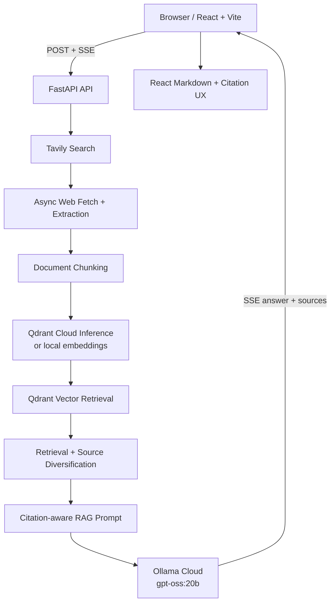

# AI Search Engine

A source-grounded AI search application that combines live web search, semantic retrieval, and streamed LLM answers with linked citations.

## Live Demo

- [Open the application](https://ai-search-engine-wine-three.vercel.app)
- [API health endpoint](https://ai-search-engine-api.onrender.com/health)

> The API is deployed on Render's free tier, so its first request after inactivity can take longer while the service starts.

## What It Does

1. A user asks a question in the React interface.
2. The backend searches the live web, fetches relevant pages, and extracts readable content.
3. Extracted documents are chunked and semantically retrieved for the current request.
4. The LLM generates a source-grounded response as an SSE stream.
5. The interface renders Markdown incrementally and connects valid citations to source cards.

## Key Features

- Live web search through Tavily and asynchronous page ingestion
- Retrieval-augmented generation (RAG) with Qdrant semantic search
- Qdrant Cloud Inference support alongside local embedding providers
- Request-scoped vector retrieval to isolate one query's temporary context from another
- Source diversification after candidate retrieval
- Streamed answers over Server-Sent Events (SSE)
- Markdown answers, interactive citations, grouped citation support, and responsive source cards
- Provider abstractions for local and cloud-compatible LLM, embedding, and vector configurations
- Offline retrieval, source-diversification, and citation evaluation harnesses

## Architecture



## Request Lifecycle

1. FastAPI receives the query through an answer or search endpoint.
2. Tavily returns live web results for the query.
3. The ingestion service fetches pages concurrently and extracts their main content.
4. The resulting documents are chunked.
5. Depending on configuration, chunks use Qdrant Cloud Inference or a configured local/cloud embedding provider.
6. Chunks are indexed under a newly created request scope.
7. Qdrant performs semantic retrieval filtered to that request scope.
8. Source diversification limits over-representation from a single source.
9. A prompt builder labels the retrieved context and instructs the model to cite only supplied sources.
10. The LLM streams answer deltas and the source list over SSE.
11. React incrementally renders the Markdown answer and turns valid citations into source links.

## Production Stack

| Concern | Production service |
| --- | --- |
| Frontend | Vercel |
| Backend | Render (FastAPI) |
| Live search | Tavily |
| Vector database | Qdrant Cloud |
| Embedding / vector inference | Qdrant Cloud Inference — `intfloat/multilingual-e5-small` (384 dimensions) |
| Generation | Ollama Cloud — `gpt-oss:20b` |

## Local Development

Local development keeps the same orchestration flow while using local services where appropriate:

- Frontend: Vite development server with an `/api` proxy to FastAPI
- Backend: FastAPI/Uvicorn
- Vector database: local Qdrant through Docker Compose
- Generation: local Ollama is supported
- Embeddings: the local Ollama embedding provider is supported

The current local defaults are `qwen3:4b-instruct` for generation and `embeddinggemma` (768 dimensions) for embeddings. See [`backend/.env.example`](backend/.env.example) for the complete, authoritative configuration.

## Tech Stack

| Area | Technologies |
| --- | --- |
| Backend | Python 3.12+, FastAPI, Pydantic Settings, HTTPX, Trafilatura, Qdrant Client, pytest, Ruff, uv |
| Frontend | React, TypeScript, Vite, react-markdown, remark-gfm, Vitest, React Testing Library |
| Hosted services | Tavily, Qdrant Cloud, Ollama Cloud, Render, Vercel |

## Repository Structure

```text
backend/
  app/
    api/            # HTTP routes, dependencies, and SSE serialization
    embeddings/     # Embedding provider abstractions
    llm/            # Generation provider abstractions
    rag/            # Chunking, prompts, orchestration, and citation evaluation
    retrieval/      # Retrieval, diversification, and evaluation
    search/         # Tavily search integration
    vectorstores/   # Qdrant integration
    web/            # Fetching, extraction, and ingestion
  scripts/          # Local evaluation runners
  tests/
frontend/
  src/
    components/     # Search, answers, and source UI
    features/       # Research flow state
    lib/            # API, SSE, and citation utilities
    types/
docker-compose.yml  # Local Qdrant
render.yaml         # Render backend service definition
```

## Local Setup

### Prerequisites

- Python 3.12 or newer
- [uv](https://docs.astral.sh/uv/)
- Node.js and npm
- Docker with Docker Compose
- Ollama (for the default local LLM and embedding configuration)
- A Tavily API key

### Start local dependencies

From the repository root:

```sh
docker compose up -d
```

Pull the models used by the default local configuration:

```sh
ollama pull qwen3:4b-instruct
ollama pull embeddinggemma
```

### Configure and run the backend

```sh
cd backend
uv sync
cp .env.example .env
```

Set `TAVILY_API_KEY` in `backend/.env`, then run:

```sh
uv run uvicorn app.main:app --reload
```

The API is available at `http://localhost:8000`; `GET /health` is a lightweight health check.

### Run the frontend

In a second terminal:

```sh
cd frontend
npm ci
npm run dev
```

With the default local setup, no frontend API base URL is required: Vite proxies `/api` requests to `http://localhost:8000`. Set `VITE_API_BASE_URL` only when the frontend should call a separately deployed backend.

## Environment Configuration

Use [`backend/.env.example`](backend/.env.example) as the source of truth. Do not commit a populated `.env` file.

| Category | Variables |
| --- | --- |
| Required for live search | `TAVILY_API_KEY` |
| Provider selection | `LLM_PROVIDER`, `EMBEDDING_PROVIDER` |
| Ollama | `OLLAMA_BASE_URL`, `OLLAMA_API_KEY` (optional), `OLLAMA_GENERATION_MODEL`, `OLLAMA_EMBEDDING_MODEL`, `OLLAMA_EMBEDDING_DIMENSIONS` |
| Qdrant | `QDRANT_URL`, `QDRANT_API_KEY` (optional), `QDRANT_COLLECTION_NAME` |
| Qdrant Cloud Inference | `QDRANT_CLOUD_INFERENCE_ENABLED`, `QDRANT_INFERENCE_MODEL`, `QDRANT_INFERENCE_DIMENSIONS` |
| Browser access | `CORS_ALLOWED_ORIGINS` |

`frontend/.env.example` contains the single public frontend setting, `VITE_API_BASE_URL`. It must never contain backend credentials or provider API keys.

## API Overview

| Method | Endpoint | Purpose |
| --- | --- | --- |
| `GET` | `/health` | Service health check |
| `POST` | `/api/v1/search` | Run a live Tavily search |
| `POST` | `/api/v1/answer` | Return a complete grounded answer and sources |
| `POST` | `/api/v1/answer/stream` | Stream a grounded answer and sources over SSE |

All query endpoints accept a JSON body containing `query`:

```sh
curl -X POST http://localhost:8000/api/v1/search \
  -H 'Content-Type: application/json' \
  -d '{"query":"What is retrieval-augmented generation?"}'
```

The streaming endpoint uses SSE over a `POST`/`fetch` request and emits progress, answer-delta, source, completion, and error events.

## Citation Behavior

The prompt asks the model to ground factual claims in the retrieved sources. The UI recognizes `[n]`, `【n】`, and grouped markers such as `[1,4]`, linking valid reference numbers to source cards.

Citation presence and marker validity do not guarantee factual correctness or that a source fully supports a claim.

## Evaluation

The repository includes offline evaluation and benchmark tooling for:

- Retrieval Hit Rate@K, Recall@K, and MRR
- Source-diversification comparisons
- Citation marker range validity and source coverage
- Grouped citation marker handling
- Local and cloud-oriented smoke harnesses

The citation benchmark is an engineering regression baseline, not a factual-correctness evaluation or performance SLA.

## Engineering Decisions

- Provider interfaces keep RAG orchestration independent of a single LLM or embedding implementation.
- Each request gets a unique Qdrant retrieval scope, preventing cross-query context contamination.
- Diversification runs after candidate retrieval to avoid a single source dominating context.
- `POST`/`fetch` SSE supports streaming a JSON query body and incremental client rendering.
- Local providers and Qdrant Cloud Inference offer compatible development and deployment paths.
- Citation parsing accepts the formats observed from models, including ASCII, Unicode, and grouped markers.
- Web content is explicitly delimited and treated as untrusted data in the RAG prompt.

## Security and Safety Notes

- API keys and remote service credentials are environment-based and backend-only.
- The Vite bundle contains no backend secrets.
- CORS uses an explicit allowlist via `CORS_ALLOWED_ORIGINS`.
- Retrieved web content is treated as untrusted context rather than executable instructions.
- `.env` files are ignored by Git.

## Known Limitations

- The Render free-tier backend can have a cold start after inactivity.
- Request-scoped Qdrant points do not currently have automatic retention cleanup.
- Collection initialization has a concurrency edge case that remains future hardening work.
- Valid citation markers do not establish factual correctness.

## Deployment

The frontend is deployed to Vercel and the FastAPI backend to Render. [`render.yaml`](render.yaml) defines the native Python Render service; production secrets are configured in the provider dashboards. Qdrant Cloud provides vector storage and cloud inference, while Ollama Cloud provides generation.

## License

No license file is currently included in this repository.
